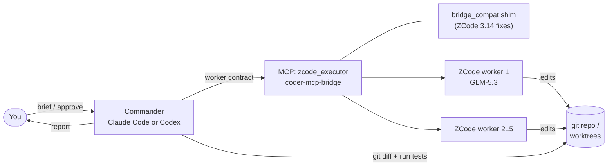
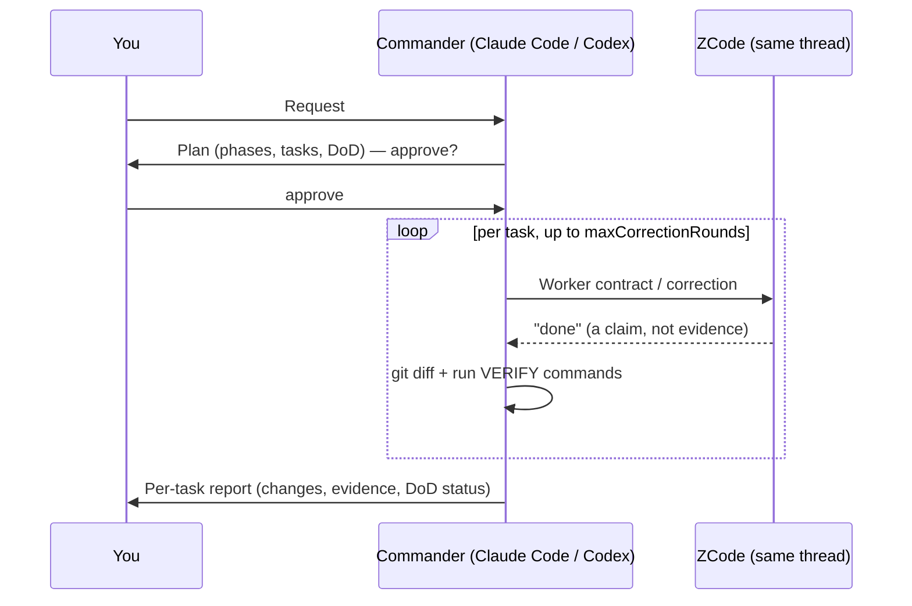

<div align="center">

# zcrew

**Claude Code or Codex plans and reviews. A crew of ZCode (GLM) agents writes the code.**

You work with one assistant, either Claude Code or OpenAI Codex. It hands implementation to ZCode workers and checks every diff itself. When something fails review, it sends the fix back to the same worker session, and it only reports to you once the work passes.

[](#requirements)
[](#tech-stack)
[](https://docs.anthropic.com/en/docs/claude-code)
[](https://github.com/openai/codex)
[](#compatibility)
[](#development)
[](LICENSE)

[Quick start](#quick-start) · [How it works](#how-it-works) · [Configuration](#configuration) · [Troubleshooting](#troubleshooting) · [ภาษาไทย](docs/README.th.md)

</div>

---

## Why

Frontier models are strongest at understanding, design and review. Coding agents are cheaper for the bulk of the typing. zcrew assigns each role to the model that fits it, and you still talk to a single assistant.

| Role | Who | Responsibility |
|---|---|---|
| **Client** | You | State the goal, approve the plan |
| **Commander** | Claude Code **or** Codex, per project, or both | Clarify → plan with Definition of Done → delegate → review diff and run tests → correct → report |
| **Crew** (up to 5) | ZCode · GLM-5.3 at `max` reasoning | Implement, write tests, fix what the reviewer rejects |

> **The executor never accepts its own work.** A worker saying "done" is a claim. Acceptance requires the commander to review `git diff` itself and run the tests itself.

## Features

- **One conversation.** No `/zcode` command and no copy-paste relay. The commander decides when to delegate.
- **Two commanders, one crew.** Use Claude Code for core logic and Codex for design work, or either one alone. Both drive the same ZCode crew, and the bridge's cross-process leases keep them from writing into the same folder at once.
- **Plan-first.** You get a short plan with phases, tasks and a Definition of Done. Nothing is delegated until you approve it.
- **Independent review loop.** The commander inspects the diff and runs your tests/build/lint itself. A rejection goes back to the same ZCode thread, so the worker keeps its context. Each task has a correction budget (default 4 rounds).
- **Parallel crew.** Up to 5 ZCode workers run on independent tasks in separate `git worktree`s. Branches are merged back one at a time, and tests are re-run after every merge.
- **Per-project opt-in.** `zcrew enable --commander claude|codex|both` activates the policy for one repo. `zcrew disable` restores its files byte for byte.
- **Context-aware.** Compact worker output (−70%), wait-until-done polling, context-hygiene rules for the commander, and `zcrew context` to measure what a session actually spent.
- **Configurable model.** GLM-5.3 at `max` by default. You can switch models globally, per project, or for a single task.
- **Live worker view.** `zcrew watch` (terminal) and `zcrew dashboard` (local browser page) show what each worker is doing as it happens: files read and edited, commands and their outcome, context size. Read-only, straight from ZCode's own database.
- **One-command install** with a built-in `doctor` that checks readiness without making any model call.

## Quick start

**1. Install** (PowerShell, no admin needed):

```powershell
irm https://raw.githubusercontent.com/b9b4ymiN/zcrew/main/get.ps1 | iex
```

The installer registers the `zcode_executor` MCP server in every commander it finds: Claude Code, Codex, or both. To choose explicitly, set `$env:ZCREW_COMMANDER = 'codex'` (or `claude` / `both`) before running it.

**2. Restart your commander app.** Quit Claude Code and/or the Codex app fully (including from the system tray) so it loads the `zcode_executor` MCP server.

**3. Enable a project:**

```powershell
cd C:\path\to\your-repo
zcrew enable                      # Claude Code (default)
zcrew enable --commander codex    # Codex
zcrew enable --commander both     # either one, whichever you open
```

**4. Open a new Claude Code or Codex session in that repo and ask for work as usual:**

```text
> Add a /health endpoint that returns the app version as JSON.
```

The commander asks a clarifying question or two, sends a plan for your approval, and then runs the ZCode crew. It reports once every task has passed its review.

## Requirements

| | Version | Notes |
|---|---|---|
| Windows | 10 / 11 | PowerShell 5.1 or 7 |
| [ZCode Desktop](https://z.ai) | **3.14.0** (tested) | Signed in with a **Z.ai individual GLM Coding Plan** |
| [Claude Code](https://docs.anthropic.com/en/docs/claude-code) and/or [Codex](https://github.com/openai/codex) | recent (Codex CLI 0.157 tested) | At least one installed and signed in |
| Python | 3.10+ | Must be on `PATH` as `python`. zcrew uses the standard library only |
| Git | any recent | Your projects must be git repos, because review relies on `git diff` |

## How it works





Every delegation carries a **worker contract** with these parts:

- `OBJECTIVE`
- `CONTEXT`
- `SCOPE`
- `DO NOT`
- `ACCEPTANCE CRITERIA`
- `VERIFY`
- `REPORT`

The commander reviews the result against that same contract. The full behaviour is defined in [`policy/COMMANDER.md`](policy/COMMANDER.md), and an example contract is in [`examples/worker-contract.md`](examples/worker-contract.md).

## Tech stack

| Layer | Technology |
|---|---|
| Commander | Claude Code (policy imported via `CLAUDE.md`) or OpenAI Codex (policy inlined in `AGENTS.override.md`). One Markdown policy serves both |
| Control plane | [Model Context Protocol](https://modelcontextprotocol.io) over stdio (JSON-RPC 2.0) |
| MCP server | [`coder-mcp-bridge`](https://github.com/Deslord319/coder-mcp-bridge) (Python), pinned commit, used unmodified |
| Compatibility layer | `bridge_compat.py`: a runtime shim that adapts the bridge to ZCode 3.12+ (account-provider snapshot, runtime auth headers, reasoning level) |
| Executor | ZCode Desktop app-server (Electron/Node, headless), running GLM-5.3 on the Z.ai Coding Plan |
| Isolation | `git worktree` per parallel worker, with cross-process resource leases in the bridge |
| Tooling | PowerShell installer (5.1/7 compatible), Python 3.10+ standard-library CLI (`zcrew`), `unittest` (294 tests) |

## Usage

```text
zcrew enable [DIR] [--commander claude|codex|both] [--with-templates] [--with-project-config] [--force]
                                                       activate the policy for a repo (default: current dir, claude)
zcrew disable [DIR] [--commander claude|codex]         remove it (default: everything); files restored byte for byte
zcrew status [DIR]                                     enabled? which config? is it valid?
zcrew config [--project DIR]                           print and validate the effective config
zcrew doctor                                           readiness check (no model call)
zcrew context [DIR] [--session ID|PATH] [--json]       where the last commander session's context went (per tool)
zcrew watch [DIR] [--all] [--since MIN]                follow ZCode workers live in the terminal
zcrew dashboard [DIR] [--all] [--port N] [--no-open]   the same in a local browser page (127.0.0.1 only)
zcrew runs [DIR] [--all] [--limit N] [--json]          list worker runs, newest first
zcrew show SESSION [--json]                            one run's activity (id or prefix, e.g. sess_83cb)
zcrew update [--commander auto|claude|codex|both]     pull the latest release and re-run setup
zcrew uninstall [--keep-config] [--yes]                remove zcrew
zcrew version
```

Useful phrases in chat:

- `use Flash for this task` switches to `GLM-5.3-Flash` for that task only.
- `go` / `ship` skips the clarification and approval steps.
- `switch the default model to …` makes the commander edit your config and validate it.

**Context budget:** `zcrew context` reads the latest Claude Code session for the project (`--commander codex` for Codex) and reports the first, peak and last context size, plus tool-output share per tool and per MCP server, with hints. It shows only numbers and tool names, and it never writes anything. The policy's *Context hygiene* rules (log long output to a file, read ranges, delegate exploration, review diffs) target the biggest consumers it finds.

**Watching the crew:** open a second terminal in the project and run `zcrew watch`, or `zcrew dashboard` for a browser view. Each worker gets a label (`w1`, `w2`, …) and every line is one action:

```text
14:02:11 w1 sess_83cb1cd2 > started: Add login API
14:02:13 w1 R src/auth.ts
14:02:15 w1 E src/auth.ts (+24 -3)
14:02:31 w1 $ npm test -> 2 failed
14:03:40 w1 # turn completed: 9 tool call(s), 0 error(s), 1m29s
```

Both read ZCode's local database (`~/.zcode/cli/db/db.sqlite`) read-only, so they also show runs started from the ZCode app or in parallel worktrees. They never show the model's reasoning or full tool output. The dashboard binds to `127.0.0.1` only and rejects other Host headers. If ZCode ever changes how it stores data, a self-check switches to a slower exact mode and prints a one-line note instead of showing wrong numbers.

## Project instruction files

Each role reads its own file, so every agent gets only the instructions meant for it:

| File | Read by | Put here |
|---|---|---|
| `CLAUDE.md` | **Claude Code** (commander); Codex reads it too when told by its policy | What the project is, its architecture and boundaries, the **VERIFY commands** (test/typecheck/lint/build), what never changes without asking, and the zcrew import block |
| `AGENTS.override.md` | **Codex** (commander). Codex prefers it over `AGENTS.md` in the same folder | The zcrew commander policy, inlined by `zcrew enable --commander codex` (Codex has no file imports) |
| `AGENTS.md` | **ZCode** (workers). ZCode loads it automatically from the working directory and its parents | Standing worker rules (no git commits, stay in SCOPE, never weaken tests, no secrets), the **report format**, and project commands and style |

Keeping the Codex policy in `AGENTS.override.md` is what lets Codex act as commander while ZCode, which reads `AGENTS.md`, stays a worker. After `zcrew update`, `zcrew status` flags a Codex policy copy that is out of date. Re-run `zcrew enable --commander codex` to refresh it.

Start from the templates:

```powershell
zcrew enable --with-templates
```

- Creates `CLAUDE.md` and `AGENTS.md` from [`templates/`](templates/). A file that already exists is never overwritten.
- Fill in the `<...>` placeholders, then **commit `AGENTS.md`**. Parallel workers run in `git worktree`s and only see committed files.
- `zcrew disable` deletes a template file only if you never edited it. Edited files are kept.
- `zcrew status` shows whether `AGENTS.md` is still the unedited template.

## Configuration

zcrew merges three layers, and the first one found wins: `<repo>/.claude/zcode-commander.json` → `~/.zcode-commander/config.json` → built-in defaults.

```json
{
  "model": { "providerId": "account:zai-individual-coding-plan", "modelId": "GLM-5.3" },
  "thoughtLevel": "max",
  "maxWorkers": 5,
  "maxCorrectionRounds": 4,
  "timeoutSeconds": 1800
}
```

| Key | Meaning | Allowed |
|---|---|---|
| `model.providerId` | ZCode account provider | An account provider your plan is entitled to |
| `model.modelId` | Model name | A model offered by that provider, e.g. `GLM-5.3`, `GLM-5.3-Flash` |
| `thoughtLevel` | Reasoning effort | `high`, `max` |
| `maxWorkers` | Parallel ZCode workers | 1–5 |
| `maxCorrectionRounds` | Review/correct rounds per task before the commander escalates to you | 1–10 |
| `timeoutSeconds` | Per-run timeout | 60–86400 |

`zcrew config` validates every value, including whether the model exists and whether your plan is entitled to it.

## Compatibility

| Component | Status |
|---|---|
| ZCode 3.14.0 | ✅ Validated end-to-end: single run, review/correction on the same thread, two parallel workers |
| Other ZCode versions | ⚠️ `zcrew doctor` warns. Run a small task first, because ZCode's headless protocol changed in 3.12 |
| Z.ai individual GLM Coding Plan | ✅ |
| Start / Team / Off-peak plans | ❌ These need the desktop host (captcha or encrypted keys) |
| macOS / Linux | ❌ Not yet. The bridge supports them; zcrew's installer and launcher are Windows-only |

ZCode 3.14 needed five fixes in the headless path: provider-table env vars, the `runtimeModel` removal, the account-provider push, runtime auth headers, and a required reasoning level. They are documented, with evidence, in [SPEC-RFD §26](SPEC-RFD.md#26-validation-results-v020-2026-09-26).

## Troubleshooting

Start with `zcrew doctor`. Every line says what to fix.

| Symptom | Fix |
|---|---|
| `ZCode CLI config: model.main is not set` | Sign in to ZCode Desktop, then run `zcrew update` |
| `[WARN] zcode version … untested` | ZCode was updated. Run a small task before relying on it |
| `Select a model before continuing` / `Provider Registry 中不存在 Model` | Check that the ZCode app is signed in with an individual Coding Plan, and that `model.providerId` is `account:zai-individual-coding-plan` |
| `Reasoning level is required …` | Make sure `~/.zcode-commander/bridge_compat.py` exists, then run `zcrew update` |
| Claude Code / Codex doesn't see `zcode_executor` | Quit the app completely and start it again. Check with `claude mcp get zcode_executor` or `codex mcp get zcode_executor`. Run `zcrew update --commander both` to register it in both |
| Codex acts as a worker instead of a commander | Run `zcrew status`; if Codex is not enabled or the policy is STALE, run `zcrew enable --commander codex`, then start a new Codex session |
| Runs don't appear in the ZCode app | Restart the ZCode app, because it loads its task list at startup |
| Can't remove a worktree ("busy") | Run `git worktree prune`. The folder frees up once the commander app exits |

ZCode's own logs are in `~/.zcode/cli/log/`. Diagnostic switches (environment variables):

- `ZCODE_COMMANDER_ACCOUNT_PROVIDER=off`
- `ZCODE_COMMANDER_RUNTIME_MODEL=on`
- `ZCODE_COMMANDER_DEFAULT_REASONING=high`

## Uninstall

```powershell
zcrew disable C:\path\to\each\enabled\repo
zcrew uninstall
```

zcrew never edits your global `~/.claude/CLAUDE.md`. The one exception is removing the import line left by a v0.1.x install, and only if that line is present.

## Development

```powershell
git clone https://github.com/b9b4ymiN/zcrew.git
cd zcrew
python -m unittest discover -s tests -v
```

```text
get.ps1                     one-command bootstrap (irm | iex)
scripts/zcrew.py            CLI
scripts/install.ps1         installer: bridge clone (pinned), MCP registration, policy, config seed
scripts/zcode_bridge_launcher.py   finds ZCode, sets env, starts the shim
scripts/bridge_compat.py    ZCode 3.12+ compatibility shim for coder-mcp-bridge
scripts/commander.py        enable/disable/status/config
scripts/doctor.py           readiness checks
scripts/context_report.py   zcrew context
scripts/zcode_activity.py   read-only reader over ZCode's database (sessions + activity)
scripts/activity_cli.py     zcrew runs / show / watch
scripts/dashboard.py        zcrew dashboard server (+ dashboard.html)
templates/                  CLAUDE.md + AGENTS.md starters for projects
policy/COMMANDER.md         the commander policy (Claude Code and Codex)
SPEC-RFD.md                 design rationale, decisions, validation results
```

If a change affects roles, the MCP architecture, acceptance, the correction loop, security boundaries or Windows assumptions, update `SPEC-RFD.md` and `CHANGELOG.md` as well (SPEC §24).

## Roadmap

- [ ] Validate policy adherence in fresh sessions on real projects
- [ ] macOS / Linux installer
- [ ] Track upstream ZCode releases, with a compatibility matrix in CI
- [ ] Optional OpenCode / Pi executors (already supported by the bridge)

## Credits

- [`coder-mcp-bridge`](https://github.com/Deslord319/coder-mcp-bridge) (MIT): the MCP control plane.
- [`zcode-acp`](https://github.com/william0wang/zcode-acp) (Apache-2.0): its account-provider approach for ZCode 3.12+ is ported in `bridge_compat.py`.
- [`zcode-executor`](https://github.com/KyoMio/zcode-executor): the commander/executor pattern with evidence-first acceptance.

See [NOTICE](NOTICE). zcrew is not affiliated with Anthropic, Zhipu AI / Z.ai, or the projects above.

## License

[Apache-2.0](LICENSE)
